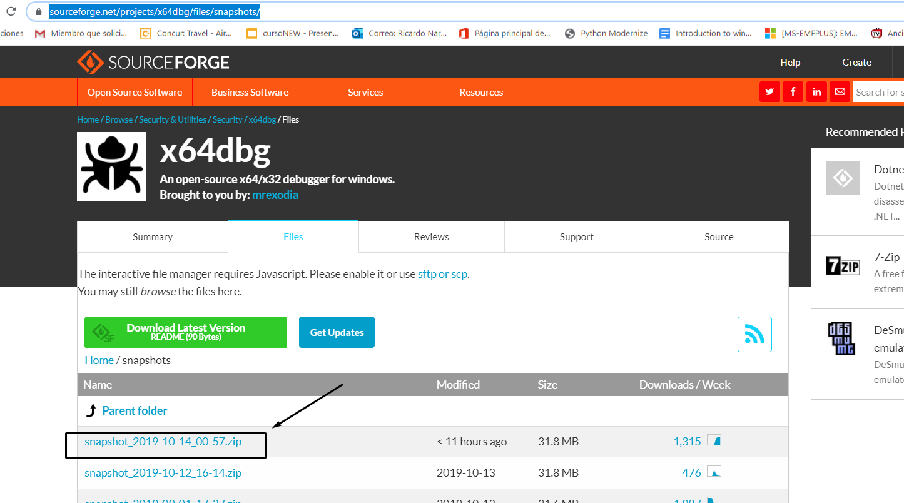
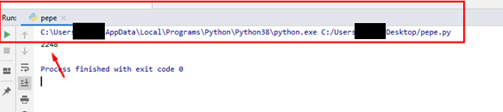

# Часть 1

Мы начнём новый курс, который будет посвящен эксплоитингу и реверсингу в WINDOWS с использованием бесплатных инструментов и которые могут быть бесплатно получены из интернета. (IDA FREE, RADARE, WINDBG, X64DBG, GHIDRA и т.д.)

Мы не будем использовать ни один платный инструмент. Идея курса состоит не в том, чтобы создать конкуренцию между различными инструментами, а в том, чтобы научиться использовать их. В моем случае, мы научимся использовать RADARE и GHIDRA, которые являются инструментами, которые я не использую ежедневно, и поэтому я постараюсь использовать их как могу, при условии, что я вообще не являюсь экспертом в этих двух инструментах. Поэтому, если кто-то увидит какую-либо ошибку или лучший способ их использования, было бы хорошо, если бы вы мне дали знать об этом, чтобы я исправил свои ошибки и научился чему-то новому.

Этот курс начинается с установки инструментов, затем небольшой теории уязвимостей, а затем очень простых примеров эксплуатации, которые увеличиваются в сложности по мере обучения. В этом курсе не будет введения в инструкции на ассемблере. Всё это есть в предыдущем курсе REVERSING CON IDA PRO, а также в других предыдущих курсах и на многих интернет-сайтах. Здесь мы перейдем непосредственно к эксплуатации и реверсингу. Все те, кто сомневается в ассеблерных инструкциях, можете обратиться к предыдущим курсам, чтобы уточнить эти сомнения.

Для создания моего рабочего окружения первым делом нужно будет установить инструменты.

## УСТАНОВКА IDA FREE

Чтобы загрузить IDA FREE, Вы можете перейти по этой ссылке:

[https://www.hex-rays.com/products/ida/support/download\_freeware.shtml](https://www.hex-rays.com/products/ida/support/download_freeware.shtml)


Отсюда нужно загрузить файл IDAFREE70\_WINDOWS, и сама установка очень проста. Просто следуйте инструкциям установщика и у вас на компьютере быстро появится иконка с IDA FREE.


## УСТАНОВКА RADARE

Следующим шагом нужно установить RADARE2.

Нужно только перейти на страничку проекта:

[https://github.com/radareorg/radare2/releases](https://github.com/radareorg/radare2/releases)

Здесь нам нужно найти последний релиз.


На данный момент это версия 3.9.0. В будущем здесь будет доступна новая версия. Независимо от того, какая сейчас версия на сайте, нам нужно скачать установщик самой новой версии для WINDOWS.


Установка также очень проста. Просто добавьте путь в переменные окружения по которому он был установлен.


Здесь в переменную окружения PATH добавить следующие строки:

````
C:\Users\<nombre_de_usuario>\AppData\Local\Programs\radare2
C:\Users\<nombre_de_usuario>\AppData\Local\Programs\radare2\bin
````


Идея состоит в том, чтобы в командной строке (CMD) мы могли бы ввести RADARE2 и запустить его.


## УСТАНОВКА GHIDRA

Установить GHIDRA также очень просто. Нужно только перейти на страничку проекта.

[https://ghidra-sre.org/](https://ghidra-sre.org/)


Здесь нужно загрузить ZIP архив. В моем случае он назывался GHIDRA\_9.1-BETA\_DEV\_20190923.ZIP, и я распаковываю его, например, на рабочий стол. Я создаю виртуальную машину VMWARE без подключения к Интернету, которую я буду использовать только для GHIDRA. Я не доверяю АНБ (какой параноик то, прим. Яши), поэтому лучше работать так.

После распаковки вы должны установить JAVA. Вы можете скачать её через страницу ORACLE или с других сайтов. В моем случае нужно скачать этот установщик и после завершения установки добавить путь к месту расположения JAVA BIN, к переменным среды окружения.

Версия 11 на странице GHIDRA говорит, что она наиболее самая подходящая.

Те, кто уже успел поиграться с GHIDRA также говорят, что версия OPENJDK 11 лучше всего подходит для неё.

[https://adoptopenjdk.net/releases.html?variant=openjdk11&jvmVariant=hotspot](https://adoptopenjdk.net/releases.html?variant=openjdk11&jvmVariant=hotspot)


После загрузки установщика у вас есть возможность добавить путь к двоичному файлу JAVA.EXE через переменную среды PATH.


После завершения установки JAVA можно запустить GHIDRA.


Просто запустить этот BAT-ник и GHIDRA начнет загружаться.


Хорошо. У нас практически все готово.

## УСТАНОВКА X64DBG

Новые снимки для этого отладчика выходят почти ежедневно.

[https://sourceforge.net/projects/x64dbg/files/snapshots/](https://sourceforge.net/projects/x64dbg/files/snapshots/)

Конечно нам нужно загрузить самую последнюю сборку на текущий момент.



В моем случае это снапшот под именем SNAPSHOT\_2019-10-14\_00-57.ZIP

Как только мы распаковали архив нужно зайти в папку RELEASE.


При запуске от имени администратора нам появится лаунчер, чтобы мы могли выбрать 32-х или 64-х битную версию отладчика в зависимости от того что нам нужно.


Мы можем скачать плагин SNOWMAN для декомпиляции, так как IDA FREE не поставляется с плагином декомпиляции и добавить его в папку плагинов.


[https://github.com/x64dbg/snowman/releases/tag/plugin-v1](https://github.com/x64dbg/snowman/releases/tag/plugin-v1)

32-х битную версию плагина нужно скопировать в папку плагинов для 32-битной версии отладчика и аналогично поступить для 64-х битной версии плагина.


## УСТАНОВКА WINDBG

Если Вы используете WINDOWS 10, то установите отладчик WINDBG через магазин MICROSOFT. Просто поищите по ключевому слову WINDBG и установите его оттуда.


Из магазина автоматически установится WINDBG PREVIEW, который является самой новой версией. Если же Вы используете WINDOWS 7, Вам придется установить более раннюю версию WINDBG.

[https://drive.google.com/open?id=1UEPBecOoir-nhyRK-RHOAhRq05ZtlW1y](https://drive.google.com/open?id=1UEPBecOoir-nhyRK-RHOAhRq05ZtlW1y)

Здесь есть несколько разных версий, очень старые и не очень.


Это самые новые версии отладчиков для WINDOWS 7, которые у меня есть. Если они Вам не подойдут, то есть некоторые предыдущие версии в папке OLD VERSIONS.

Следующим шагом будет необходимо настроить символы для WINDBG, создать папку под названием SYMBOLS на диске C:\\, а затем перейти к переменным среды окружения и добавить переменную \_NT\_SYMBOL\_PATH.


Этой переменной нужно присвоить такое значение:

`SRV*c:\symbols*http://msdl.microsoft.com/download/symbols`

После этого у нас будет установлен WINDBG PREVIEW.


Затем Вы можете установить какой-нибудь шестнадцатеричный редактор, например такой как HxD, который является бесплатным.

[https://mh-nexus.de/en/hxd/](https://mh-nexus.de/en/hxd/)


## УСТАНОВКА PYTHON

Мы будем устанавливать самый свежий PYTHON 3, чтобы иметь возможность создавать эксплойты для каждого упражнения.

[https://www.python.org/downloads/](https://www.python.org/downloads/)


Это самая последняя версия, которая существует на данный момент когда я пишу этим строки. Её я и загружу.

PYTHON-3.8.0-AMD64.EXE

Чтобы добавить путь к исполняемому файлу PYTHON.EXE в переменную среды PATH в установщике нужно поставить чек-бокс и он сделает это за Вас автоматически.

Обычно путь выглядит так:

`C:\Users\XXXXX\AppData\Local\Programs\Python\Python38`

Папка PYTHON38 будет называться по другому в зависимости от версии.

Это нам нужно, чтобы запускать PYTHON из командной строки.


## УСТАНОВКА PYCHARM COMMUNITY

[https://www.jetbrains.com/pycharm/download/](https://www.jetbrains.com/pycharm/download/)


В моем случае PYCHARM-COMMUNITY-2019.2.3.EXE является последней версий. Для Вас она может быть другой.


После установки нам нужно создать проект.


В меню RUN → DEBUG видно интерпретатор, который будет обрабатывать наши команды.


Также в SETTINGS найдите PROJECT INTERPRETER и убедитесь, что обнаружен PYTHON 3.8 или тот который Вы используете в своём случае.


Затем я создаю файл PEPE.TXT, переименовываю его в PEPE.PY и перетаскиваю в редактор:


Я пишу небольшой кусок кода, и запускаю его с помощью кнопки RUN и интерпретатор должен мне напечатать следующее значение — 2248.




PYCHARM должен автоматически дополнять текст. Также если мы выделяем мышью, например, слово OS, то когда мы нажимаем клавишу CTRL должна открыться соответствующая библиотека os.


На этом мы заканчиваем первую часть. Она посвящена установке инструментов, которые мы собираемся использовать. Вторую часть мы посвятим переполнению буфера, небольшой теории, и сделаем первые простые упражнения, которые мы разберем вместе, другие я оставлю для вас. Также не забывайте про домашние задания, которые я буду оставлять для Вас. Практика намного важнее теории, без неё никуда.

До встречи во второй части.
Ricardo Narvaja
18/10/2019

Источник:
[**[http://ricardonarvaja.info/WEB/INTRODUCCION AL REVERSING CON IDA PRO DESDE CERO/EN INGLES/](http://ricardonarvaja.info/WEB/EXPLOITING%20Y%20REVERSING%20USANDO%20HERRAMIENTAS%20FREE/ESPANIOL/1-EXPLOITING%20Y%20REVERSING%20USANDO%20HERRAMIENTAS%20GRATUITAS.docx)**](http://ricardonarvaja.info/WEB/EXPLOITING%20Y%20REVERSING%20USANDO%20HERRAMIENTAS%20FREE/ESPANIOL/1-EXPLOITING%20Y%20REVERSING%20USANDO%20HERRAMIENTAS%20GRATUITAS.docx)

Перевод на английский:
Fare9
18/10/2019

Перевод на русский:
Yashechka
28/10/2019
